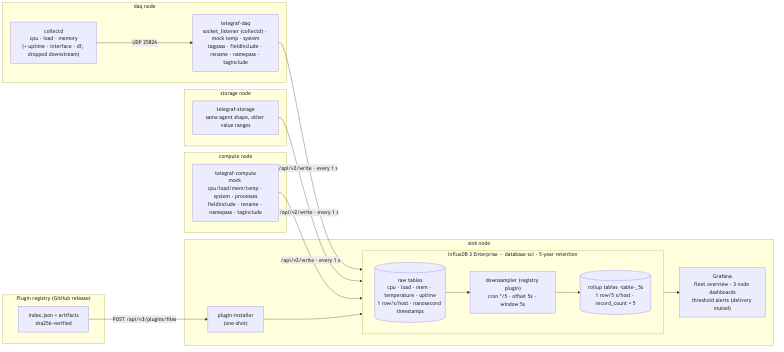

# influxdb3-ref-scientific-infrastructure

**Reference architecture: InfluxDB 3 Enterprise for scientific research infrastructure.**
Precision monitoring of the machines behind an experiment — a data-acquisition
node, a compute node and a storage node — with the TIG stack (Telegraf,
InfluxDB 3, Grafana) plus collectd, built around four ideas: *nanosecond
timestamps, five-year retention, in-database downsampling, and many small
agents converging on one schema.*



Three remote nodes each run a Telegraf agent that ships CPU, load, memory,
temperature and uptime once a second. The `daq` node's CPU, load and memory
come from **collectd** over the binary network protocol; on `compute` and
`storage` they are synthetic (`inputs.mock`). Every agent **filters and
reshapes** what it collects so that all three write the same five tables with
the same fields and a single `host` tag. Inside InfluxDB 3 the **Processing
Engine** rolls the 1-second raw tables into 5-second dashboard tables, and
**Grafana** reads only those.

## Quickstart (5 minutes)

Prereqs: Docker with Compose. First boot asks for an email — InfluxDB 3
Enterprise sends a license-validation link you must click (an address that
was validated before is verified without a click).

```bash
git clone https://github.com/influxdata/influxdb3-ref-scientific-infrastructure.git
cd influxdb3-ref-scientific-infrastructure
make up          # prompts for email, brings up the stack
# … click the validation link in your email (first time for that address) …
make open        # Grafana at http://localhost:3000 — no login needed to view
```

Within about two minutes of validation the **Fleet overview** shows all three
nodes `UP` with their uptime, and each **node dashboard** shows current values
and 5-second history. `make demo` walks through the same thing with commentary.

## What's in this repo

| Path | What it is |
|---|---|
| `docker-compose.yml` | token-bootstrap → influxdb3 → **plugin-installer** → init → three Telegraf agents (+ collectd) → grafana |
| `telegraf/` | One config per node (`daq.conf`, `compute.conf`, `storage.conf`) and the minimal `types.db` the collectd parser needs |
| `collectd/` | The DAQ node's collectd image and config |
| `influxdb/init.sh` | Database with 5-year retention, explicit table schemas, downsampling triggers (`influxdb/schema.md` is the table reference) |
| `installer/` | Installs the pinned `downsampler` plugin from the [plugin registry](https://github.com/influxdata/influxdb3_plugins/releases/tag/registry) via `POST /api/v3/plugins/files` — no `gh:` paths, no plugin bind mount |
| `grafana/` | Provisioned datasource, dashboards (fleet overview, node template + three generated node dashboards) and alert rules |
| `scripts/` | `demo.sh` narrative demo · `setup.sh` license email prompt · `gen-node-dashboards.sh` |
| `ARCHITECTURE.md` | Topology, the filter/reshape tables, downsampling alignment, gotchas, scaling to production |

## Headline features demonstrated

- **Nanosecond timestamps.** Every agent sets `[agent] precision = "1ns"`.
  Telegraf's default rounds collected timestamps to whole seconds at a 1 s
  interval; here every row keeps nine fractional digits, and collectd's own
  high-resolution timestamps pass through the service input untouched
  (`make cli-example name=nanosecond-timestamps`).
- **Five-year retention.** `create database sci --retention-period 5y` — every
  table inherits it, `influxdb3 show retention` reports it, and a write older
  than the cutoff is rejected with HTTP 400 rather than silently kept.
- **Processing Engine downsampling.** The registry `downsampler` plugin,
  pinned and sha256-verified, runs one trigger per raw table on a wall-clock
  cron (`*/5 * * * * *`) with a 5 s offset, so every 5-second bucket is
  complete when it is read and written exactly once (`record_count` is always
  5). Grafana never touches the raw tables.
- **Multiple Telegraf agents, one schema.** Three agents, three different
  sources (collectd, mock, mock), one write contract: `namepass` allowlists
  the five measurements, `fieldinclude` drops the noisy fields, `taginclude`
  keeps only `host`, `tagpass` picks the right collectd rows, and scoped
  `rename` blocks map plugin naming (`collectd_cpu` + `value`) onto the
  convention (`cpu` + `usage_active`).

## Filtering and reshaping, per agent

| Agent | Sources | Dropped on purpose | Renamed |
|---|---|---|---|
| `daq` | collectd (cpu, load, memory) · `inputs.mock` (temperature) · `inputs.system` (uptime) | collectd memory free/cached/buffered/slab, uptime, interface, df (`tagpass` + output `namepass`); `system` load/n_cpus/n_users (`fieldinclude`); tags `type`, `type_instance`, `instance` (`taginclude`) | `collectd_cpu`→`cpu` (`value`→`usage_active`), `collectd_load`→`load` (`shortterm`→`load1` …), `collectd_memory`→`mem`, `temp`→`temperature`, `system`→`uptime` |
| `compute`, `storage` | `inputs.mock` (cpu, load, mem, temp) · `inputs.system` (uptime) · `inputs.processes` | `processes` (output `namepass`); `usage_user/system/iowait/steal`, `available_percent`, `cached_percent`, `system` extras (`fieldinclude`); tags `cpu`, `sensor` (`taginclude`) | `temp`→`temperature` (`temp`→`temp_c`), `system`→`uptime` |

The full "which metric is stopped by which filter" tables are in
[`ARCHITECTURE.md`](ARCHITECTURE.md) §5.

## Configuration

`.env` (see `.env.example`): license email and type, Grafana port and admin
password, registry index URL / offline artifact dir. Alert thresholds live in
`grafana/provisioning/alerting/rules.yaml`; mock value ranges in the Telegraf
configs. Alerts fire in the UI and go nowhere by design (no contact points, and
a muted catch-all route).

## Scaling to production

This demo is single-node with a `file` object store, and the remote agents read
the admin token from the shared volume. Production notes — scoped write
tokens per node, real sensors instead of mocks, shorter raw retention with
long rollup retention, S3/GCS/Azure, multi-node topologies, TLS — are in
[`ARCHITECTURE.md`](ARCHITECTURE.md) §11. For a multi-node compose reference,
see [`influxdb3-ref-network-telemetry`](https://github.com/influxdata/influxdb3-ref-network-telemetry).

## The portfolio

This repo is part of the [InfluxDB 3 Enterprise reference architecture
portfolio](https://github.com/influxdata/influxdb3-reference-architectures) —
one runnable repo per vertical, shared conventions, different domain stories.

## License

[Apache 2.0](LICENSE)
